<div align="center">

# 🔐 SSHM

**Gérez les clés SSH de tous vos serveurs depuis une interface web.**

Ajoutez vos serveurs, donnez ou retirez l'accès à une personne en un clic, pour toujours ou pour 10 minutes.


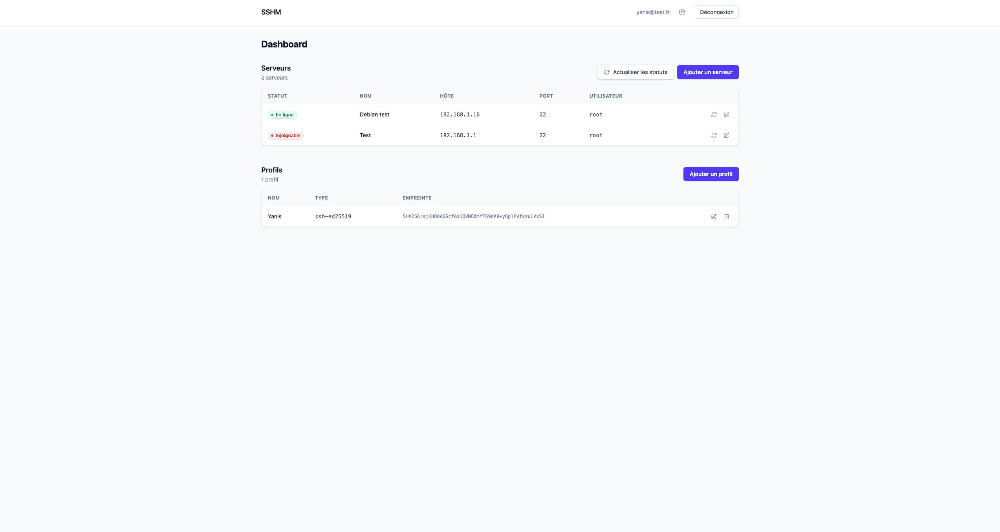

</div>

---

## Sommaire

- [Pourquoi SSHM ?](#pourquoi-sshm-)
- [Fonctionnalités](#fonctionnalités)
- [Installation](#installation)
- [Configuration](#configuration)
- [Les fonctionnalités en détail](#les-fonctionnalités-en-détail)
- [Sécurité et limites](#sécurité-et-limites)
- [Tests](#tests)
- [Architecture](#architecture)

---

## Pourquoi SSHM ?

Ajouter la clé d'un collègue sur dix serveurs, penser à la retirer à son départ, donner un accès « juste le temps d'une intervention »… À la main, on finit toujours par oublier une clé quelque part.

SSHM se connecte à vos serveurs avec **sa propre clé SSH** et gère pour vous les fichiers `~/.ssh/authorized_keys` : il les lit, y ajoute des clés et en supprime, pour n'importe quel compte du serveur. Il n'y a pas de console web : SSHM exécute uniquement les commandes dont il a besoin.

## Fonctionnalités

| | |
|---|---|
| 🖥️ **Parc de serveurs** | Ajout, modification, statut en ligne / injoignable actualisable en direct |
| 🔑 **Clé SSH de l'application** | Générée en un clic, clé privée chiffrée en base, commande d'installation prête à copier |
| ✅ **Test de connexion** | Vérifie que SSHM peut se connecter et exécuter une commande sur le serveur |
| 👀 **Clés autorisées** | Liste des clés de chaque compte (root, debian, deploy…) avec badges *Connue*, *Inconnue*, *Master* et *Profil* |
| 👤 **Profils** | Une personne ou une machine = un nom + une clé publique |
| ➕ **Autoriser un profil** | Sur le compte de son choix, de façon permanente ou temporaire (10 min → 7 jours) |
| ⏱️ **Expiration automatique** | La clé est refusée par `sshd` à l'heure prévue, puis supprimée du serveur |
| 🗑️ **Révocation** | Suppression de n'importe quelle clé, sauf celle de SSHM |

---

## Installation

### Prérequis

| | Version | Remarque |
|---|---|---|
| Ruby | 3.4.2 | voir `.ruby-version` |
| PostgreSQL | 14+ | |
| Google Chrome | récent | uniquement pour les tests système |
| **Serveurs gérés** | OpenSSH **8.2+** | requis pour les accès temporaires (Debian 11+, Ubuntu 20.04+) |

### En local

```bash
git clone git@github.com:YanisDahmane/sshm.git
cd sshm

bundle install
bin/rails db:prepare   # crée la base et lance les migrations
bin/dev                # serveur Rails + compilation Tailwind
```

L'application est disponible sur **http://localhost:3000**. Créez votre compte via « Créer un compte ».

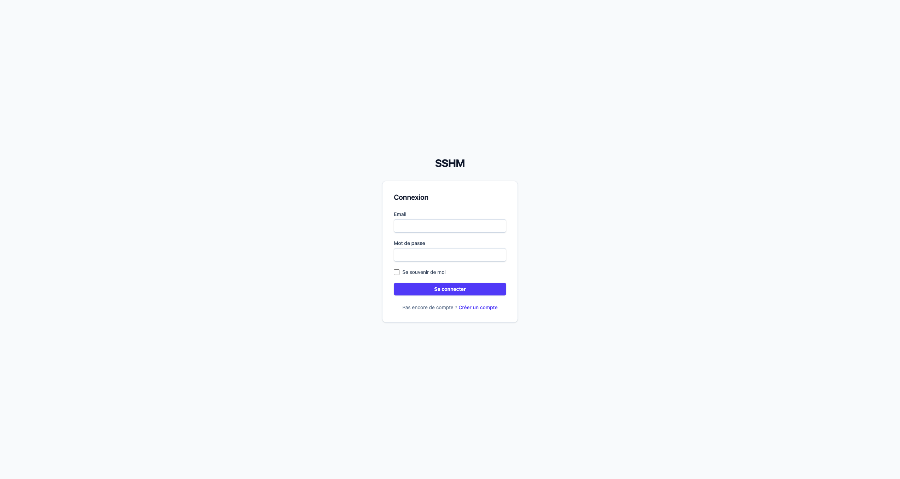

> [!NOTE]
> En développement, les jobs (expiration des accès temporaires) tournent **en mémoire** : ils s'exécutent tant que `bin/dev` reste lancé et sont perdus au redémarrage. En production, Solid Queue les stocke en base.

### En production (Kamal)

Le projet est prêt pour [Kamal](https://kamal-deploy.org) (`config/deploy.yml`) : image Docker, proxy avec SSL, jobs Solid Queue intégrés à Puma (`SOLID_QUEUE_IN_PUMA`).

1. Renseignez dans `config/deploy.yml` votre serveur, votre registry, votre domaine (`proxy.host`) et l'accès à PostgreSQL :

   ```yaml
   env:
     secret:
       - RAILS_MASTER_KEY
       - SSHM_DATABASE_PASSWORD
     clear:
       SOLID_QUEUE_IN_PUMA: true
       PGHOST: votre-serveur-postgres   # utilisé par les 4 bases (primary, cache, queue, cable)
   ```

2. Ajoutez `SSHM_DATABASE_PASSWORD` dans `.kamal/secrets`. L'utilisateur PostgreSQL attendu est `sshm`, avec les bases `sshm_production`, `sshm_production_cache`, `sshm_production_queue` et `sshm_production_cable`.

3. Déployez :

   ```bash
   bin/kamal setup    # première fois
   bin/kamal deploy   # les fois suivantes
   ```

> [!IMPORTANT]
> Le volume `sshm_storage` (monté sur `/rails/storage`) contient `storage/ssh/known_hosts`, les empreintes des serveurs mémorisées par SSHM. Ne le supprimez pas : SSHM refuserait de se reconnecter à un serveur dont l'empreinte aurait « changé ».

---

## Configuration

### 1. Credentials et clés de chiffrement

La clé privée SSH de l'application est chiffrée en base avec [Active Record Encryption](https://guides.rubyonrails.org/active_record_encryption.html). Les clés de chiffrement se trouvent dans `config/credentials.yml.enc`, lui-même déchiffré par `config/master.key` (jamais versionné).

**Vous avez déjà le `master.key` du projet** : placez-le dans `config/master.key` (ou dans la variable `RAILS_MASTER_KEY`), il n'y a rien d'autre à faire.

**Vous installez votre propre instance** : générez vos propres credentials.

```bash
rm config/credentials.yml.enc
bin/rails db:encryption:init      # affiche un bloc active_record_encryption: ...
bin/rails credentials:edit        # collez-y ce bloc, enregistrez
```

> [!CAUTION]
> Si vous perdez le `master.key`, la clé privée SSH stockée en base devient illisible : il faudra en régénérer une et la redéployer sur tous les serveurs. Sauvegardez-le.

### 2. Générer la clé SSH de SSHM

Ouvrez **Paramètres** (icône ⚙️ en haut à droite), puis cliquez sur **Générer une clé SSH**. SSHM crée une paire de clés Ed25519 et affiche :

- l'**empreinte** (`SHA256:…`) ;
- la **clé publique**, à copier ;
- une **commande prête à l'emploi** à lancer sur chaque serveur.

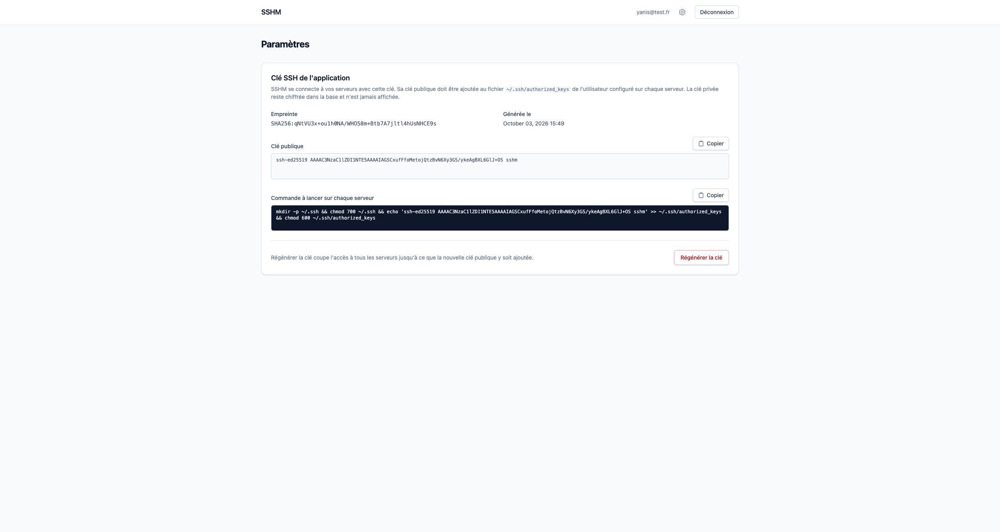

La clé privée n'est jamais affichée. **Régénérer la clé** supprime l'ancienne : SSHM perd l'accès à tous les serveurs tant que la nouvelle clé publique n'y a pas été installée.

### 3. Installer la clé sur vos serveurs

Sur chaque serveur, avec le compte que SSHM utilisera pour se connecter (par exemple `root`) :

```bash
mkdir -p ~/.ssh && chmod 700 ~/.ssh \
  && echo 'ssh-ed25519 AAAAC3NzaC1lZDI1NTE5AAAA… sshm' >> ~/.ssh/authorized_keys \
  && chmod 600 ~/.ssh/authorized_keys
```

(c'est la commande que la page Paramètres vous donne déjà, avec votre clé)

### 4. Se connecter avec un utilisateur non root (optionnel)

SSHM peut gérer les clés de **n'importe quel compte** du serveur :

- **Si SSHM se connecte en `root`**, il lit et modifie directement les fichiers des autres comptes, puis leur en redonne la propriété (`chown`).
- **S'il se connecte avec un autre utilisateur** (par exemple `deploy`), il gère les fichiers de `deploy` directement, et ceux des autres comptes via `sudo -n` (sans mot de passe). Il faut donc autoriser `deploy` dans sudoers :

  ```bash
  # /etc/sudoers.d/sshm — à éditer avec : visudo -f /etc/sudoers.d/sshm
  deploy ALL=(root) NOPASSWD: /bin/sh, /usr/bin/sh
  ```

> [!WARNING]
> Autoriser `sh` en root revient à donner un accès root complet à ce compte. C'est nécessaire pour gérer les clés des autres utilisateurs. Sans cette règle, SSHM affiche « Accès root impossible » pour ces comptes, et seules les clés de `deploy` restent gérables.

---

## Les fonctionnalités en détail

### 🖥️ Gérer son parc de serveurs

Depuis le dashboard, **Ajouter un serveur** demande :

| Champ | Exemple |
|---|---|
| Nom | `Debian test` |
| Hôte (IP ou nom de domaine) | `192.168.1.16` ou `srv-01.example.com` |
| Port | `22` |
| Utilisateur | `root` |

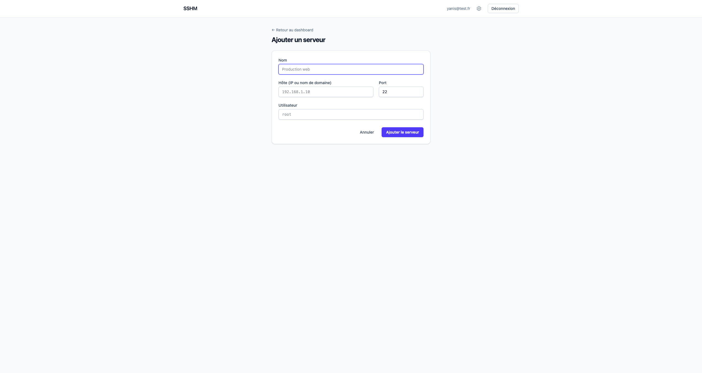

Il n'y a **pas de mot de passe** : toutes les connexions passent par la clé de SSHM.

### 🟢 Statut en ligne / injoignable

Chaque serveur affiche un badge **En ligne**, **Injoignable** ou **Inconnu** (jamais vérifié). Le test est une connexion TCP sur le port SSH (3 s maximum) : pas besoin de droits root, et il fonctionne même si le ping ICMP est bloqué.

- **Actualiser les statuts** vérifie tous les serveurs en parallèle.
- L'icône 🔄 d'une ligne vérifie un seul serveur.

Les badges passent sur « Vérification… » puis se mettent à jour **sans recharger la page** (Turbo Streams).

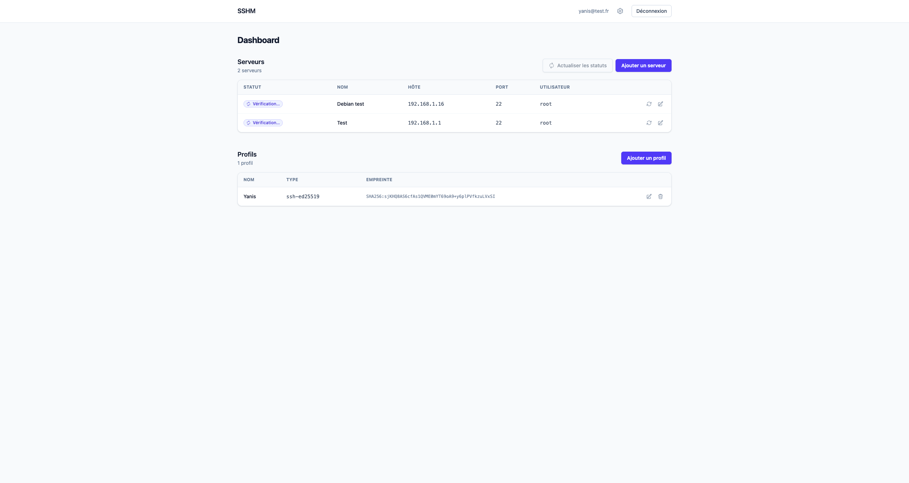

### 🔍 La page d'un serveur

Cliquez sur le nom d'un serveur pour ouvrir sa page : statut, test de connexion SSH et clés autorisées.

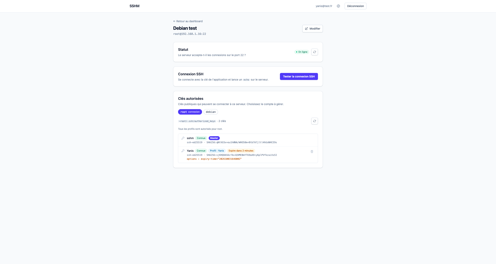

**Tester la connexion SSH** se connecte avec la clé de SSHM, lance `echo sshm-check-<aléatoire>` et vérifie la réponse. En cas d'échec, la cause est expliquée : *Aucune clé SSH configurée*, *Clé SSH refusée par le serveur*, *L'empreinte du serveur a changé*, *Connexion impossible*…

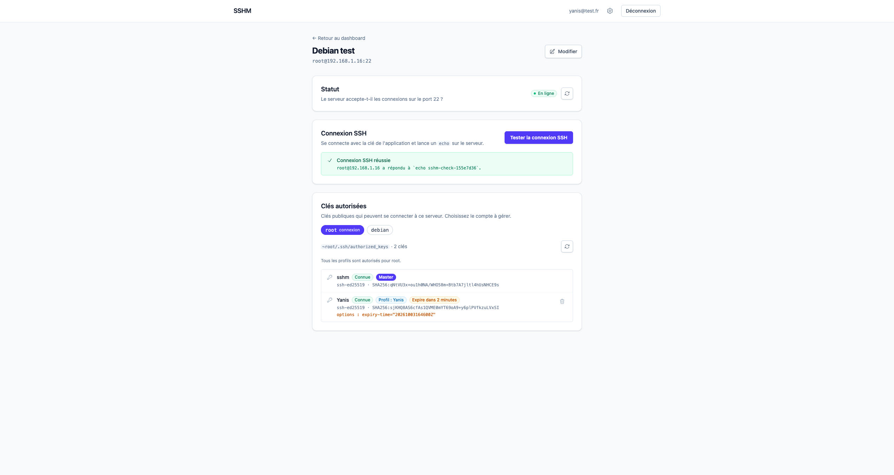

### 👀 Les clés autorisées, compte par compte

La section **Clés autorisées** affiche un **onglet par compte du serveur** : `root`, puis les utilisateurs humains découverts dans `/etc/passwd` (`debian`, `alice`…). Pour chaque clé :

| Badge | Signification |
|---|---|
|  | La clé a un commentaire (son « nom ») |
|  | Pas de commentaire : à qui est-elle ? |
|  | C'est la clé de SSHM (impossible à supprimer) |
|  | La clé appartient à un profil SSHM (reconnue par son empreinte, même renommée) |
|  | Accès temporaire en cours |

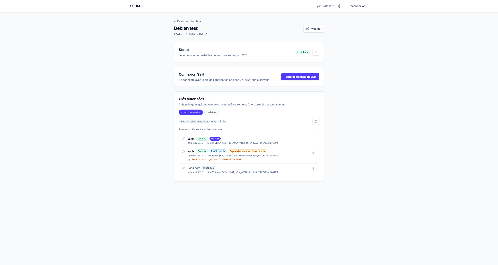

Le type, l'empreinte et les éventuelles options (`from=…`, `no-pty`, `expiry-time=…`) sont aussi affichés.

### 👤 Les profils

Un profil, c'est **un nom et une clé publique**, par exemple `Alice` et `ssh-ed25519 AAAA… alice@laptop`. On les gère depuis le dashboard : ajout, modification, suppression, et une page de détail avec la clé copiable.

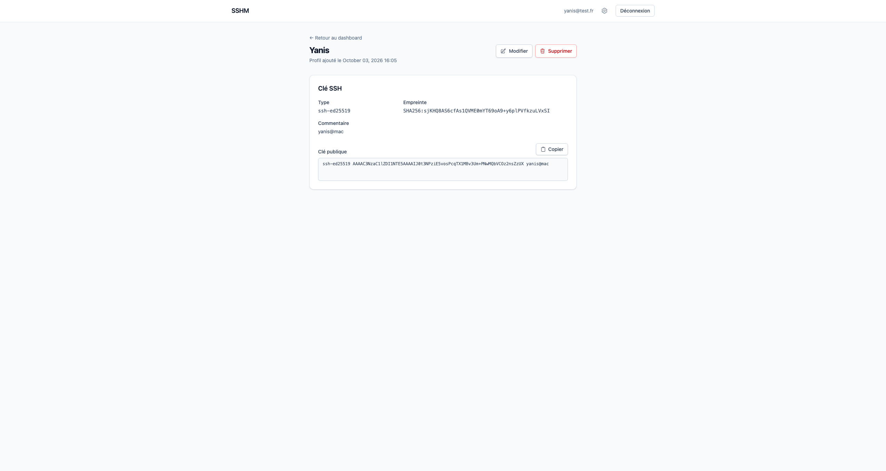

SSHM refuse :
- une **clé privée** collée par erreur (avec un message explicite) ;
- plusieurs clés d'un coup, ou une clé avec des options ;
- une clé déjà utilisée par un autre profil ;
- la clé de SSHM elle-même.

### ➕ Autoriser un profil, pour toujours ou pour 10 minutes

Sur la page d'un serveur, choisissez l'onglet du compte, puis **Autoriser un profil pour …**, et éventuellement une **Durée**.

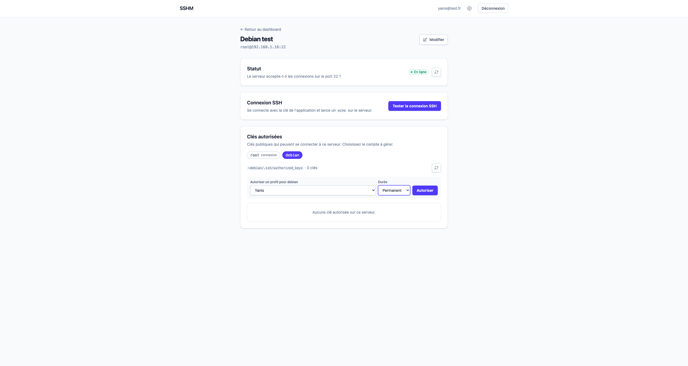

#### Exemple : donner 10 minutes d'accès à « Profil 1 » sur `debian@Debian test`

1. Ouvrez **Debian test**, puis l'onglet **debian**.
2. Choisissez **Profil 1** et la durée **10 minutes**, puis cliquez sur **Autoriser**.
3. SSHM ajoute cette ligne dans `/home/debian/.ssh/authorized_keys` :

   ```
   expiry-time="20261003145200Z" ssh-ed25519 AAAAC3NzaC1lZDI1NTE5AAAA… Profil 1
   ```

4. La personne peut se connecter : `ssh debian@192.168.1.16`.
5. **À 14:52 UTC**, `sshd` refuse la clé, puis SSHM supprime la ligne du fichier.

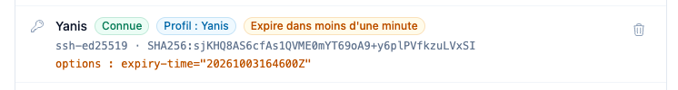

Quelques règles :

| Situation | Résultat |
|---|---|
| Ré-autoriser en **permanent** un profil qui a un accès temporaire | L'expiration est retirée, la clé reste |
| Donner un **nouvel** accès temporaire | Il remplace le précédent (nouvelle échéance) |
| Accès temporaire sur une clé **déjà permanente** | Rien ne change, la clé reste permanente |
| Supprimer la clé à la main | L'accès temporaire est terminé |

#### Comment l'expiration est garantie

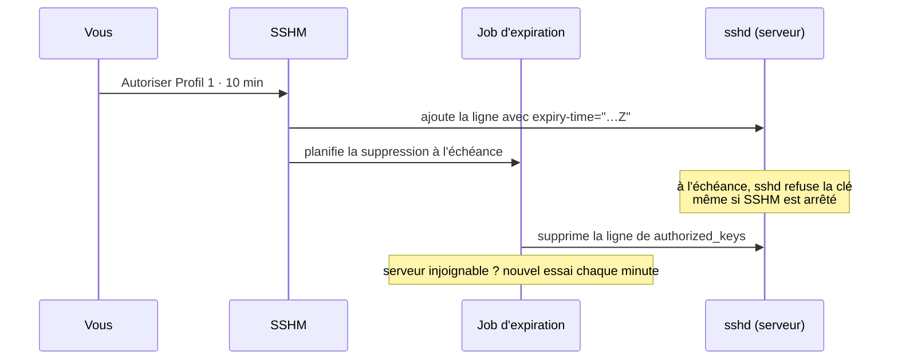

1. **`sshd` refuse la clé à l'heure prévue** grâce à l'option OpenSSH `expiry-time`, que SSHM soit en marche ou non.
2. **Un job supprime ensuite la ligne.** En production, une tâche récurrente rattrape chaque minute les expirations manquées.

### 🗑️ Supprimer une clé

L'icône 🗑️ d'une clé la supprime du compte, après confirmation. Toutes les lignes contenant cette clé sont retirées, le reste du fichier (commentaires, autres clés) est conservé à l'identique, ainsi que ses droits et son propriétaire. La clé **Master** de SSHM ne peut pas être supprimée : l'application perdrait l'accès au serveur.

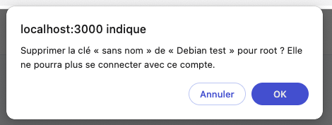

---

## Sécurité et limites

> [!WARNING]
> **L'inscription est ouverte.** Toute personne qui peut atteindre l'application peut se créer un compte et gérer les clés de vos serveurs. Placez SSHM derrière un VPN ou un réseau privé, ou désactivez l'inscription une fois votre compte créé (retirez `:registerable` dans `app/models/user.rb`).

**Ce que SSHM protège :**
- La clé privée de SSHM est chiffrée en base et n'est jamais affichée.
- Les empreintes des serveurs sont mémorisées à la première connexion ; une empreinte qui change bloque la connexion.
- SSHM n'utilise que sa propre clé : jamais vos clés `~/.ssh` ni votre ssh-agent.
- Toutes les valeurs envoyées dans les commandes shell sont échappées, et les noms d'utilisateur sont validés strictement.
- Les fichiers écrits ont des droits stricts (`700` pour `~/.ssh`, `600` pour `authorized_keys`).

**Limites des accès temporaires :**
- Une session **déjà ouverte** n'est pas coupée à l'échéance : `sshd` ne vérifie l'expiration qu'à la connexion.
- L'échéance dépend de **l'horloge du serveur** (gardez NTP actif).
- Pendant son accès, une personne avec un shell peut **ajouter sa propre clé permanente** dans `authorized_keys`. Elle apparaîtra alors comme « Inconnue » dans SSHM. Pour l'empêcher, utilisez un fichier de clés non modifiable par l'utilisateur, par exemple `AuthorizedKeysFile /etc/ssh/authorized_keys/%u` (fichiers appartenant à root).

---

## Tests

```bash
bin/rails test          # tests unitaires, d'intégration, services et jobs
bin/rails test:system   # tests navigateur (Chrome headless)
bin/rubocop             # style
bin/brakeman            # analyse de sécurité
```

- Les tests **ne contactent jamais de vrais serveurs** : SSH est simulé (`test/support/fake_ssh.rb`) et les tests réseau utilisent des sockets locaux.
- Les **scripts shell** envoyés aux serveurs sont exécutés pour de vrai avec `sh` dans un dossier personnel temporaire (`test/support/local_shell_helpers.rb`).

> [!TIP]
> Si `bin/rails test:system` échoue avec *This version of ChromeDriver only supports Chrome version …*, mettez ChromeDriver à jour (`brew upgrade --cask chromedriver`) ou désinstallez-le pour laisser Selenium télécharger la bonne version.

---

## Architecture

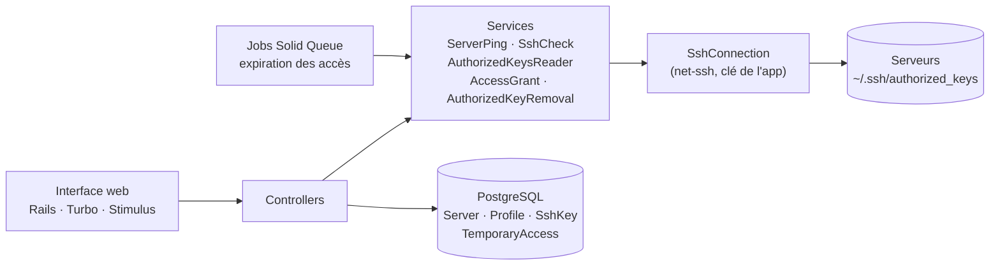

| Dossier | Contenu |
|---|---|
| `app/models` | `Server`, `Profile`, `SshKey`, `TemporaryAccess`, et `AuthorizedKey` / `AuthorizedKeysAccount` (objets Ruby simples) |
| `app/services` | Connexion SSH, ping, lecture et écriture des `authorized_keys`, génération de clés |
| `app/jobs` | Expiration des accès temporaires |
| `app/javascript/controllers` | Stimulus : badges de vérification, copie dans le presse-papiers, masquage de la barre Turbo |

**Stack :** Rails 8 · PostgreSQL · Hotwire (Turbo + Stimulus) · Tailwind CSS 4 · Devise · net-ssh · Solid Queue · Kamal.
